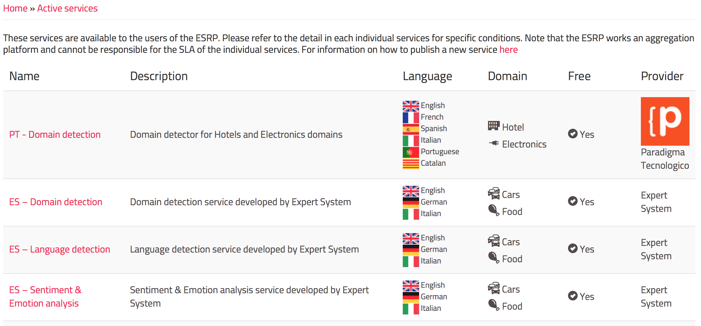
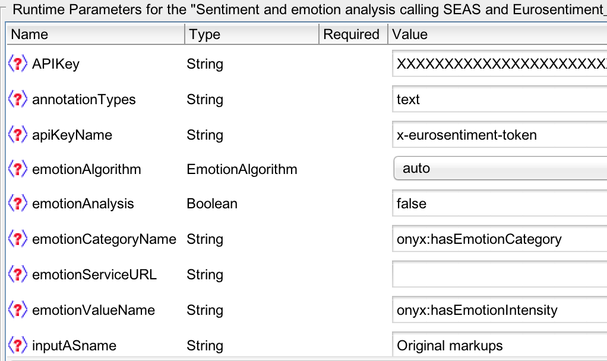
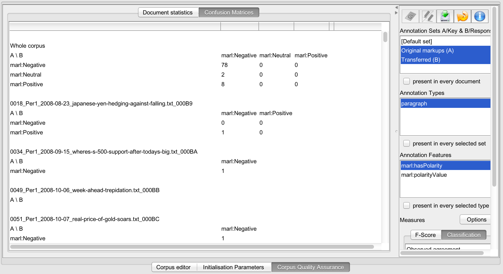
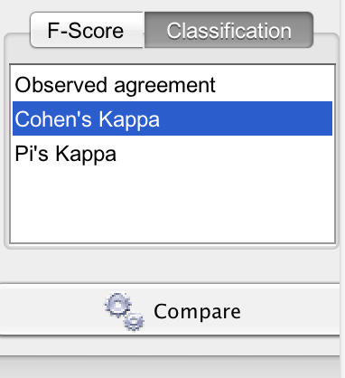

[SAGA](https://github.com/gsi-upm/SAGA)
=====


## Introduction
SAGA (Sentiment and Emotion Analysis integrated in GATE)  is a set of processing and linguistic resources, written in Java, developed to run sentiment and emotion analysis over text using [GATE](http://gate.ac.uk) platform.
SAGA is distributed as a GATE plugin.

## Getting started
Whether you intend to use this repository as an user or as a developer, you should download the last release of [GATE Developer](https://gate.ac.uk/family/developer.html) in order to run the graphic mode of this tool. You can find it in its [download page](https://gate.ac.uk/download/#latest). This download will include GATE Developer and Embedded and requires at least Java 7 in order to be run.
If you are not familiar with GATE, check out these [training modules](https://gate.ac.uk/conferences/training-modules.html) to understand what GATE can do.

If you are a developer, you should know that in order to develop your own processing resources using GATE Embedded (GATE APIs), a suitable Java Development Environment is required. We strongly recommend using [Eclipse IDE for Java EE developers](http://www.eclipse.org/downloads/packages/eclipse-ide-java-ee-developers/keplersr1), because it's going to make easier the next configuration tasks.

## Installation
The installation process couldn't be easier:

1. Download this [zip](http://demos.gsi.dit.upm.es/SAGA/saga.zip).
2. Unzip the folder called _saga_ into the folder called _plugins_ that is inside your GATE installation.
3. Open GATE. The new plugin should be available.


Another way to install it is to open GATE -> File -> Manage CREOLE Plugins -> Configuration tab -> Click on the + symbol -> add the repository name: GSI UPM  url,  http://demos.gsi.dit.upm.es/SAGA/gate-update-site.xml -> Apply all -> Available to install tab -> Mark the SAGA plugin to install it -> Apply all -> Go to the Installed Plugins tab. There it is.

It is recommended to deploy [SEAS's project](https://github.com/gsi-upm/SEAS) as a local service in your computer to use this plugin.

## How to use the plugin
This plugin contains only one PR that offers a variety of sentiment and emotion analysis services. To load it, right click on Processing Resources -> New -> Sentiment and emotion analysis calling SEAS and Eurosentiment -> Name it -> OK.


Then, add this new PR to your current application or create a new one (Right click on Applications -> Create new application -> Corpus Pipeline -> Name it -> OK) so you can configure its runtime parameters:


These parameters can be explained as follows:

    inputASName:
        The Annotation Set that contains the annotation type to be analyzed
    annotationType:
        The annotation type to be analyzed
    sentimentAnalysis:
        Runtime parameter that sets if the PR is going to perform sentiment analysis with the chosen algorithm.
    emotionAnalysis:
        Runtime parameter that sets if the PR is going to perform emotion analysis with the chosen algorithm.
    SentimentServiceURL:
        The endpoint of the sentiment analysis service
    EmotionServiceURL:
        The endpoint of the emotion analysis service, you can use:
            If you deploy SEAS as a local service in your computer (Recommended):
                http://localhost:8080/SAGAtoNIF/Service
                http://localhost:8080/RestrictedToNIF/RestrictedService
            ONLY FOR LITTLE TESTS:
                http://demos.gsi.dit.upm.es/tomcat/SAGAtoNIF/Service
                http://demos.gsi.dit.upm.es/tomcat/RestrictedToNIF/RestrictedService
        For more endpoints visit the Eurosentiment portal - https://portal.eurosentiment.eu
    APIKey:
        Eurosentiment token to use their services or other similar services that require an API KEY
    ApiKeyName:
        Eurosentiment (or other similar services) token name to use their services
    sentimentAlgorithm:
        Runtime parameter that sets the sentiment algorithm that the service is going to use. At the moment, you can use dictionary based algorithms.
    sentimentDictionary:
        Runtime parameter that sets the sentiment dictionary that the service is going to use (in case that sentimentAlgorithm has been chosen). You can use:
        AUTO (Detects language)
        Spanish_finances_Paradigma (SentimentServiceURL = http://demos.gsi.dit.upm.es/tomcat/SAGAtoNIF/Service)
        English_finances_Loughran_McDonald (SentimentServiceURL = http://demos.gsi.dit.upm.es/tomcat/RestrictedToNIF/RestrictedService)
        Emoticon (SentimentServiceURL = http://demos.gsi.dit.upm.es/tomcat/SAGAtoNIF/Service)
        Spanish_finances_and_Emoticon (SentimentServiceURL = http://demos.gsi.dit.upm.es/tomcat/SAGAtoNIF/Service)
        English_finances_and_Emoticon (SentimentServiceURL = http://demos.gsi.dit.upm.es/tomcat/RestrictedToNIF/RestrictedService)
    emotionAlgorithm:
        Runtime parameter that sets the emotion algorithm that the service is going to use. You can use:
        AUTO (Detects language)
        onyx (no endpoint needed)
        ANEW2010All (EmotionServiceURL = http://demos.gsi.dit.upm.es/tomcat/RestrictedToNIF/RestrictedService)
        ANEW2010Men (EmotionServiceURL = http://demos.gsi.dit.upm.es/tomcat/RestrictedToNIF/RestrictedService)
        ANEW2010Woman (EmotionServiceURL = http://demos.gsi.dit.upm.es/tomcat/RestrictedToNIF/RestrictedService)
    SentimentPolarityName:
        The name of the sentiment polarity feature
    SentimentValueName:
        The name of the sentiment value feature
    EmotionCategoryName:
        The name of the emotion category feature
    EmotionValueName:
        The name of the emotion value feature
        
## Example of use - Sentiment analysis over a finance domain
In this example we are going to see how to create a corpus inside GATE, how to populate it and then we are going to set the corresponding runtime parameters of this processing resource to perform sentiment analysis over a finance domain.

1. Create a new corpus and populate it: to do so, right click on Language resources -> New -> Gate Corpus -> Name it -> OK. Right click on the corpus -> Populate -> Go to the _saga_ plugin folder -> _resources_ -> _example_ -> Choose _service_ -> OK
2. Set _emotionAnalysis_ parameter to _false_
3. Configure the runtime parameters as follows (Be careful, the features inside the annotationType you choose to analyze will be substituted with the results of the analysis.):


3. Run this application.
4. Check the results:


## Example of use - Emotion analysis using Onyxemote
In this example we are going to see how to create a corpus inside \ac{GATE}, how to populate it and then we are going to set the corresponding runtime parameters of this processing resource to perform emotion analysis calling Onyxemote service.

1. Create a new corpus and populate it: to do so, right click on Language resource -> New -> Gate Corpus -> Name it -> OK. Right click on the corpus -> Populate -> Go to the _saga_ plugin folder -> _resources_ -> _example_ -> Choose _emotion_ -> OK
2. Set _sentimentAnalysis_ parameter to _false_
3. Configure the runtime parameters as follows (Be careful, the features inside the annotationType you choose to analyze will be substituted with the results of the analysis.):


3. Run this application.
4. Check the results:


## Example of use - Eurosentiment services
In this example we are going to see how to create a corpus inside \ac{GATE}, how to populate it and then we are going to set the corresponding runtime parameters of this processing resource to perform sentiment analysis calling one of the services available at Eurosentiment Portal.

1. Sign up in the [EUROSENTIMENT portal](https://portal.eurosentiment.eu/accounts/signup/). Register yourself as a _Service Developer_.
2. You will recieve an access token in your mail. Put it in the runtime parameter called _APIKey_.
3. Set the runtime parameter called _ApiKeyName_ as _x-eurosentiment-token_.
4. Set the runtime parameters called _SentimentServiceURL_ or _EmotionServiceURL_ whith the ones offered in the [EUROSENTIMENT portal](https://portal.eurosentiment.eu/service/list#) that perform sentiment or emotion analysis.


The PR configuration should look like this:



1. Load your corpus: to do so, right click on Language resource -> New -> Gate Corpus -> Name it -> OK. Right click on the corpus -> Populate -> Go to the _saga_ plugin folder -> _resources_ -> _example_ -> _input_ -> Choose _eurosentiment_ -> OK
2. Set _sentimentAnalysis_ parameter to _true_
3. Run the application.
4. Check the results:


## Sentiment Annotation QA
You can test our services over a sentiment annotated corpus to see how good this analysis tool works. In this project we include a set of positive and negative texts from an article called "Extracting Investor Sentiment from Weblog Texts: A Knowledge-based Approach" by Klein, A; Altuntas, O; Hausser, T. and Kessler, W.
To do so:

1. Create a new corpus and populate it: to do so, right click on Language resource -> New -> Gate Corpus -> Name it _pos_ -> OK. Right click on the corpus -> Populate -> Go to the _saga_ plugin folder -> _resources_ -> _example_ -> _positivenegatice_ -> Choose _pos_ -> OK
2. Create a new corpus and populate it: to do so, right click on Language resource -> New -> Gate Corpus -> Name it _neg_ -> OK. Right click on the corpus -> Populate -> Go to the _saga_ plugin folder -> _resources_ -> _example_ -> _positivenegatice_ -> Choose _neg_ -> OK
3. Load the plugin called _Tools_ and then load the _Annotation Transfer PR_. Also load the SAGA's PR called _Predefined Sentiment Annotation PR_.
4. Create a new Pipeline, configure it as follows (example for negative corpus) and run it:


1. Create a new Pipeline.
2. Configure the runtime parameters as follows and ignore the rest of them. Run it:


Run the application over each corpus and check out the results. Select a corpus, for example the negatice one. Go to Corpus Quality Assurance and configure the options as follows to get the Confusion Matrix:




You can observe that 78 out of 102 negative messages are classified as negative. Only 2 of them are classified as neutral and 8 as positive.

## How to add new NIF's services, algorithms or dictionaries?
Check out [SEAS's project](https://github.com/gsi-upm/SAGA)

## Licenses

The source code on this repository is under the following licenses:

```
Copyright (c) 2014 GSI, UPM. All rights reserved.

    This program is free software: you can redistribute it and/or modify
    it under the terms of the GNU General Public License as published by
    the Free Software Foundation, either version 3 of the License, or
    (at your option) any later version.

    This program is distributed in the hope that it will be useful,
    but WITHOUT ANY WARRANTY; without even the implied warranty of
    MERCHANTABILITY or FITNESS FOR A PARTICULAR PURPOSE.  See the
    GNU General Public License for more details.

    You should have received a copy of the GNU General Public License
    along with this program.  If not, see <http://www.gnu.org/licenses/>.
```

```
Copyright (c) 2013 GSI, UPM. All rights reserved.

Licensed under Lesser General Public License For Linguistic Resources; 
You may not use this repository and code except in compliance with the License. 
You may obtain a copy of the License at http://www.ida.liu.se/~sarst/bitse/lgpllr.html Unless required by 
applicable law or agreed to in writing, software distributed under the License is distributed on an "AS IS" BASIS,
WITHOUT WARRANTIES OR CONDITIONS OF ANY KIND, either express or implied. See the License for the specific 
language governing permissions and limitations under the License.
```


This work has been partialy funded by the Ministry of Industry, Energy and Tourism through the R&D project Financial Twitter Tracker (TSI-090100-2011-114)


EUROSENTIMENT PROJECT
Grant Agreement no: 296277
Starting date: 01/09/2012
Project duration: 24 months


