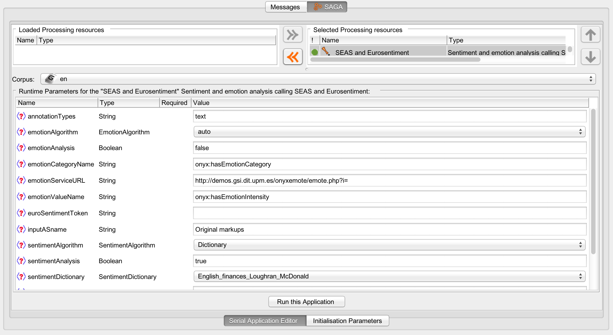

[SAGA](https://github.com/gsi-upm/SAGA)
=====


## Introduction
SAGA (Sentiment and Emotion Analysis integrated in GATE)  is a set of processing and linguistic resources, written in Java, developed to run sentiment and emotion analysis over text using [GATE](http://gate.ac.uk) platform.
SAGA is distributed as a GATE plugin.

## Getting started
Whether you intend to use this repository as an user or as a developer, you should download the last release of [GATE Developer](https://gate.ac.uk/family/developer.html) in order to run the graphic mode of this tool. You can find it in its [download page](https://gate.ac.uk/download/#latest). This download will include GATE Developer and Embedded and requires at least Java 6 update 10, 1.6.0_10, in order to be run.
If you are not familiar with GATE, check out these [training modules](https://gate.ac.uk/conferences/training-modules.html) to understand what GATE can do.

If you are a developer, you should know that in order to develop your own processing resources using GATE Embedded (GATE APIs), a suitable Java Development Environment is required. We strongly recommend using [Eclipse IDE for Java EE developers](http://www.eclipse.org/downloads/packages/eclipse-ide-java-ee-developers/keplersr1), because it's going to make easier the next configuration tasks.

## Installation
The installation process couldn't be easier:

1. Download or clone this repository.
2. Copy the folder called _saga_ into the folder called _plugins_ that is inside your GATE installation.
3. Open GATE. The new plugin should be available.


## How to use the plugin
This plugin contains only one PR that offers a variety of sentiment and emotion analysis services. To load it, right click on Processing Resources -> New -> Sentiment and emotion analysis calling SEAS and Eurosentiment -> Name it -> OK.


Then, add this new PR to your current application or create a new one so you can configure its runtime parameters:



These parameters can be explained as follows:

    inputASName:
        The Annotation Set that contains the annotation type to be analyzed
    annotationType:
        The annotation type to be analyzed
    sentimentAnalysis:
        Runtime parameter that sets if the PR is going to perform sentiment analysis with the chosen algorithm.
    emotionAnalysis:
        Runtime parameter that sets if the PR is going to perform emotion analysis with the chosen algorithm.
    SentimentServiceURL:
        The endpoint of the sentiment analysis service
    EmotionServiceURL:
        The endpoint of the emotion analysis service, you can use:
        http://demos.gsi.dit.upm.es/tomcat/SAGAtoNIF/Service
        http://demos.gsi.dit.upm.es/tomcat/RestrictedToNIF/RestrictedService
        For more endpoints visit the [Eurosentiment portal](https://portal.eurosentiment.eu)
    EuroSentimentToken:
        Eurosentiment token to use their services or other similar services that require an API KEY
    sentimentAlgorithm:
        Runtime parameter that sets the sentiment algorithm that the service is going to use. At the moment, you can use dictionary based algorithms.
    sentimentDictionary:
        Runtime parameter that sets the sentiment dictionary that the service is going to use (in case that sentimentAlgorithm has been chosen). You can use:
        AUTO (Detects language)
        Spanish_finances_Paradigma (SentimentServiceURL = http://demos.gsi.dit.upm.es/tomcat/SAGAtoNIF/Service)
        English_finances_Loughran_McDonald (SentimentServiceURL = http://demos.gsi.dit.upm.es/tomcat/RestrictedToNIF/RestrictedService)
        Emoticon (SentimentServiceURL = http://demos.gsi.dit.upm.es/tomcat/SAGAtoNIF/Service)
        Spanish_finances_and_Emoticon (SentimentServiceURL = http://demos.gsi.dit.upm.es/tomcat/SAGAtoNIF/Service)
        English_finances_and_Emoticon (SentimentServiceURL = http://demos.gsi.dit.upm.es/tomcat/RestrictedToNIF/RestrictedService)
    emotionAlgorithm:
        Runtime parameter that sets the emotion algorithm that the service is going to use. You can use:
        AUTO (Detects language)
        onyx (no endpoint needed)
        ANEW2010All (EmotionServiceURL = http://demos.gsi.dit.upm.es/tomcat/RestrictedToNIF/RestrictedService)
        ANEW2010Men (EmotionServiceURL = http://demos.gsi.dit.upm.es/tomcat/RestrictedToNIF/RestrictedService)
        ANEW2010Woman (EmotionServiceURL = http://demos.gsi.dit.upm.es/tomcat/RestrictedToNIF/RestrictedService)
    SentimentPolarityName:
        The name of the sentiment polarity feature
    SentimentValueName:
        The name of the sentiment value feature
    EmotionCategoryName:
        The name of the emotion category feature
    EmotionValueName:
        The name of the emotion value feature
        
## Example of use - Sentiment analysis over a finances domain
This plugin contains little corpus to test the PR:

1. Create a new corpus and populate it. Right click on the corpus -> Populate -> Go to the _saga_ plugin folder -> _resources_ -> _example_ -> _input_ -> Chose _en_ -> OK
2. Configure the runtime parameters as follows (Be careful, the features inside the annotationType you choose to analyze will be substituted with the results of the analysis.):


3. Run this application.
4. Check the results:


## Example of use - Eurosentiment services
TO DO

## Accuracy of the algorithms over an already annotated corpus
TO DO

## How to add new NIF's services, algorithms or dictionaries?
Check out [SEAS's project](https://github.com/gsi-upm/SAGA)

## Licenses

The source code on this repository is under the following licenses:

```
Copyright (c) 2014 GSI, UPM. All rights reserved.

    This program is free software: you can redistribute it and/or modify
    it under the terms of the GNU General Public License as published by
    the Free Software Foundation, either version 3 of the License, or
    (at your option) any later version.

    This program is distributed in the hope that it will be useful,
    but WITHOUT ANY WARRANTY; without even the implied warranty of
    MERCHANTABILITY or FITNESS FOR A PARTICULAR PURPOSE.  See the
    GNU General Public License for more details.

    You should have received a copy of the GNU General Public License
    along with this program.  If not, see <http://www.gnu.org/licenses/>.
```

```
Copyright (c) 2013 GSI, UPM. All rights reserved.

Licensed under Lesser General Public License For Linguistic Resources; 
You may not use this repository and code except in compliance with the License. 
You may obtain a copy of the License at http://www.ida.liu.se/~sarst/bitse/lgpllr.html Unless required by 
applicable law or agreed to in writing, software distributed under the License is distributed on an "AS IS" BASIS,
WITHOUT WARRANTIES OR CONDITIONS OF ANY KIND, either express or implied. See the License for the specific 
language governing permissions and limitations under the License.
```


This work has been partialy funded by the Ministry of Industry, Energy and Tourism through the R&D project Financial Twitter Tracker (TSI-090100-2011-114)


EUROSENTIMENT PROJECT
Grant Agreement no: 296277
Starting date: 01/09/2012
Project duration: 24 months


